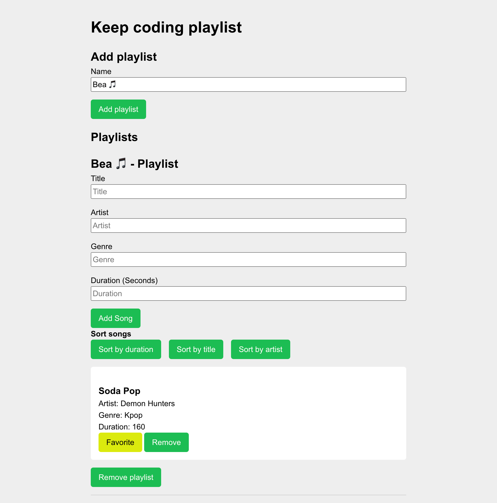
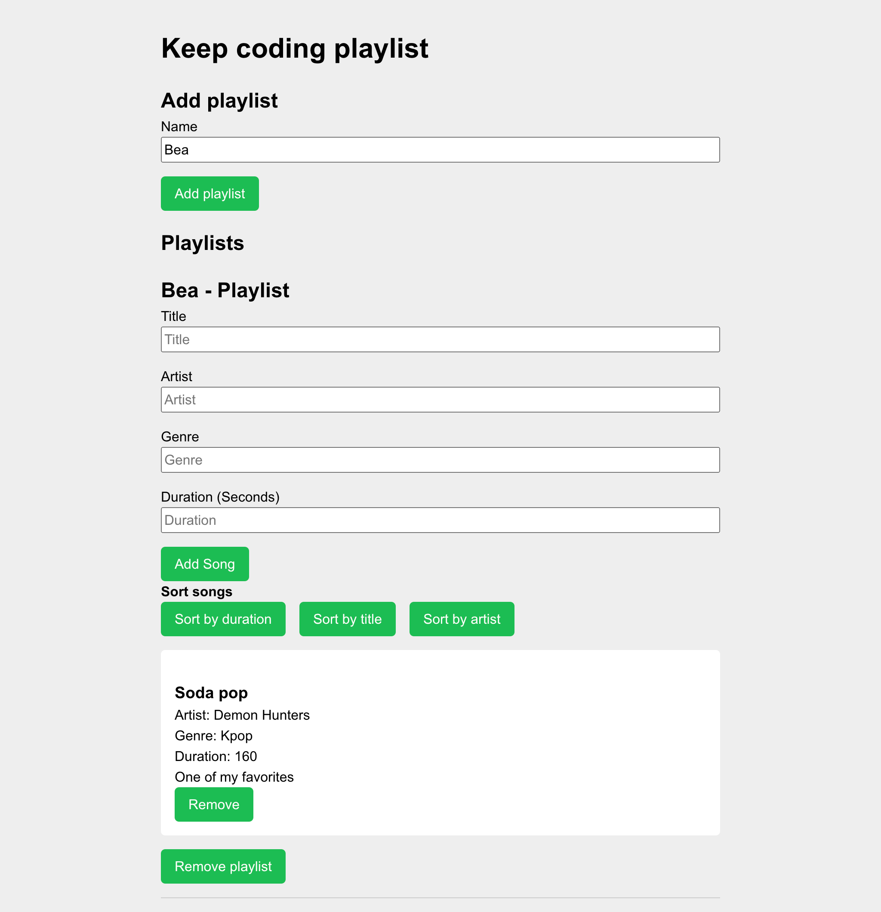

# Práctica Intro JS – ejercicios y mini‑app Playlist

Conjunto de **ejercicios prácticos de JavaScript** para afianzar el temario mediante retos de datos y una mini‑aplicación conectada al DOM (*playlist*).

## Objetivo de la práctica

Poner en práctica JavaScript trabajando con **objetos y arrays**, **transformaciones de datos (strings, números, colecciones)** y **manipulación del DOM** en una interfaz sencilla de playlist.

## Ejercicios entregados y funcionalidades

### Ejercicio 1 — `exercises/ejercicio1.js`

* Definición de objeto `user` con cursos.
* Lectura por consola de la fecha de inicio de **React** desde `user.courses`.

### Ejercicio 2 — `exercises/bug.js`

* Función `calcularPromedio(numeros)` para obtener el promedio.
* Corrección de iteración fuera de rango en el bucle del cálculo.

### Ejercicio 3 — `exercises/ejercicio3.js`

* **3.1** `buildFilePath(segments)`: compone una ruta y extensión a partir de segmentos.
* **3.2** `formatNumberWithDashes(number)`: convierte un número en texto con guiones entre dígitos.
* **3.3** `getLengthAndReverse(text)`: devuelve `longitud + texto_al_revés`.

### Ejercicio 4 — `exercises/transform.js`

* `obtenerDesarrolladoresJavascript(datos)`: devuelve las personas que tienen "JavaScript" en `habilidades`.
* `obtenerNombresProyectos(datos)`: extrae y aplana los nombres de todos los proyectos.

### Ejercicio 6 — `playlist/js/playlist.js` + `playlist/playlist.html`

* Catálogo de playlists con las funciones:

  * `createPlaylist(name)`, `getAllPlaylists()`, `removePlaylist(name)`.
  * `addSongToPlaylist(playlistName, song)` (guarda canciones con `favorite: false` por defecto).
  * `removeSongFromPlaylist(playlistName, title)`.
  * `favoriteSong(playlistName, title)`.
* Interfaz HTML para crear playlists, añadir canciones, marcar favoritas y eliminar.

## Estructura del repositorio

```
.
├── index.html                 
├── exercises/                 # Ejercicios de JavaScript
│   ├── ejercicio1.js          
│   ├── bug.js                 
│   ├── ejercicio3.js          # 3.1 rutas · 3.2 guiones entre dígitos · 3.3 longitud+reverse
│   └── transform.js           
├── playlist/                  # Mini‑app Playlist (HTML/CSS/JS)
│   ├── playlist.html          
│   ├── css/                   
│   └── js/
│       ├── dom/               
│       └── playlist.js        
├── docs/                      # Capturas incrustadas en el README
│   ├── ejercicio6-addsong-addplaylist.png
│   └── ejercicio6-favoritsong.png
├── .gitignore
└── README.md
```

## Cómo usar

### 1) Clonar e instalar

```bash
# Clonar el repositorio
git clone https://github.com/BeatrizHCastro/practica-intro-js.git
cd practica-intro-js
```

### 2) Ejecutar

**Mini‑app Playlist (navegador)**

1. Abre `playlist/playlist.html` en el navegador.
2. (Recomendado) Usa Live Server u otro servidor estático.

**Ejercicios (navegador o Node)**

* **Navegador**: abre `index.html` (si lo usas como lanzador) y revisa la consola.
* **Node** (opcional):

  ```bash
  node exercises/ejercicio1.js
  node exercises/bug.js
  node exercises/ejercicio3.js
  node exercises/transform.js
  ```

## Capturas

### Añadir playlist y canción



### Canción marcada como favorita



## Requisitos

* Navegador moderno (Chrome, Firefox, Edge o Safari).
* No se requieren librerías externas.
* (Opcional) **Node.js ≥ 20** si quieres ejecutar los ficheros de `exercises` desde terminal.

## Criterios cumplidos

* [x] **Ejercicio 1**: creación de `user` y lectura por consola de la fecha de inicio de React
* [x] **Ejercicio 2**: implementación de `calcularPromedio(numeros)` y corrección del bug de iteración
* [x] **Ejercicio 3.1**: `buildFilePath(segments)` compone la ruta + extensión
* [x] **Ejercicio 3.2**: `formatNumberWithDashes(number)` añade guiones entre dígitos
* [x] **Ejercicio 3.3**: `getLengthAndReverse(text)` devuelve longitud y texto invertido
* [x] **Ejercicio 4**: `obtenerDesarrolladoresJavascript(datos)` devuelve quienes tienen "JavaScript" en `habilidades` y `obtenerNombresProyectos(datos)` obtiene los nombres de todos los proyectos
* [x] **Ejercicio 6**: crear playlist, eliminar playlist, añadir canción, marcar como favorita y eliminar canción desde la UI
* [x] **Ejercicio 6**: eliminar playlist desde la UI
* [x] **Docs**: README actualizado

## Créditos

* Desarrollo: [@BeatrizHCastro](https://github.com/BeatrizHCastro)
* Enunciado y tutoría: [@kevinccbsg](https://github.com/kevinccbsg) (Bootcamp Full Stack Web – KeepCoding)

## Licencia

MIT © 2025 Beatriz H. Castro


---


# Intro JS Practice – exercises and playlist mini-app

Set of **JavaScript practice exercises** to reinforce the coursework through data challenges and a DOM-connected mini application (*playlist*).

## Practice objective

Put JavaScript into practice by working with **objects and arrays**, **data transformations (strings, numbers, collections)**, and **DOM manipulation** in a simple playlist interface.

## Delivered exercises and features

### Exercise 1 — `exercises/ejercicio1.js`

* Definition of `user` object with courses.
* Console output of the **React** start date from `user.courses`.

### Exercise 2 — `exercises/bug.js`

* Function `calcularPromedio(numeros)` to get the average.
* Fix for out-of-range iteration in the calculation loop.

### Exercise 3 — `exercises/ejercicio3.js`

* **3.1** `buildFilePath(segments)`: builds a path and extension from segments.
* **3.2** `formatNumberWithDashes(number)`: converts a number to text with dashes between digits.
* **3.3** `getLengthAndReverse(text)`: returns `length + reversed_text`.

### Exercise 4 — `exercises/transform.js`

* `obtenerDesarrolladoresJavascript(datos)`: returns the people who have "JavaScript" in `habilidades`.
* `obtenerNombresProyectos(datos)`: extracts and flattens the names of all projects.

### Exercise 6 — `playlist/js/playlist.js` + `playlist/playlist.html`

* Playlists catalog with the functions:

  * `createPlaylist(name)`, `getAllPlaylists()`, `removePlaylist(name)`.
  * `addSongToPlaylist(playlistName, song)` (saves songs with `favorite: false` by default).
  * `removeSongFromPlaylist(playlistName, title)`.
  * `favoriteSong(playlistName, title)`.
* HTML interface to create playlists, add songs, mark favorites and delete.

## Repository structure

```

.
├── index.html
├── exercises/                 # JavaScript exercises
│ ├── ejercicio1.js
│ ├── bug.js
│ ├── ejercicio3.js            # 3.1 paths · 3.2 dashes between digits · 3.3 length+reverse
│ └── transform.js
├── playlist/                  # Playlist mini-app (HTML/CSS/JS)
│ ├── playlist.html
│ ├── css/
│ └── js/
│ ├── dom/
│ └── playlist.js
├── docs/                      # Screenshots embedded in the README
│ ├── ejercicio6-addsong-addplaylist.png
│ └── ejercicio6-favoritsong.png
├── .gitignore
└── README.md
```

## How to use

### 1) Clone and install

```bash
# Clone the repository
git clone https://github.com/BeatrizHCastro/practica-intro-js.git
cd practica-intro-js
````

### 2) Run

**Playlist mini-app (browser)**

1. Open `playlist/playlist.html` in the browser.
2. (Recommended) Use Live Server or any static server.

**Exercises (browser or Node)**

* **Browser**: open `index.html` (if you use it as a launcher) and check the console.
* **Node** (optional):

  ```bash
  node exercises/ejercicio1.js
  node exercises/bug.js
  node exercises/ejercicio3.js
  node exercises/transform.js
  ```

## Screenshots

### Add playlist and song


### Song marked as favorite


## Requirements

* Modern browser (Chrome, Firefox, Edge or Safari).
* No external libraries required.
* (Optional) **Node.js ≥ 20** if you want to run the files in `exercises` from the terminal.

## Completed criteria

* [x] **Exercise 1**: creation of `user` and console output of the React start date
* [x] **Exercise 2**: implementation of `calcularPromedio(numeros)` and correction of the iteration bug
* [x] **Exercise 3.1**: `buildFilePath(segments)` builds the path + extension
* [x] **Exercise 3.2**: `formatNumberWithDashes(number)` adds dashes between digits
* [x] **Exercise 3.3**: `getLengthAndReverse(text)` returns length and reversed text
* [x] **Exercise 4**: `obtenerDesarrolladoresJavascript(datos)` returns those who have "JavaScript" in `habilidades` and `obtenerNombresProyectos(datos)` gets all project names
* [x] **Exercise 6**: create playlist, delete playlist, add song, mark as favorite and delete song from the UI
* [x] **Exercise 6**: delete playlist from the UI
* [x] **Docs**: README updated

## Credits

* Development: [@BeatrizHCastro](https://github.com/BeatrizHCastro)
* Brief and tutoring: [@kevinccbsg](https://github.com/kevinccbsg) (Bootcamp Full Stack Web – KeepCoding)

## License

MIT © 2025 Beatriz H. Castro
